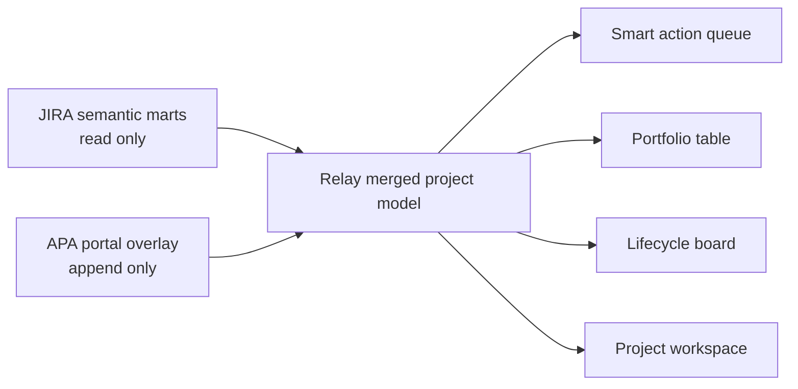

# Relay — APA Operations CRM

Relay is a frontend-first, enterprise-style workspace for managing the APA automation portfolio. It brings read-only JIRA facts, delivery health, lifecycle milestones, stakeholders, next actions, and portal-owned fields into one coherent operating view.

The MVP is deliberately usable before a backend exists. Demo changes persist in the browser through a versioned local overlay, while the UI and types follow the production base-plus-overlay architecture documented in [architecture_guide.md](architecture_guide.md).

## What is included

- A compact, explainable action queue that ranks initiatives needing attention.
- A horizontally scrollable nine-stage metric ribbon that filters the working portfolio.
- A dense, editable portfolio table with sticky project identity and typed cells.
- A nine-column operating board: derived Intake plus the eight governed Assessment → Deployment milestones from the architecture guide.
- Drag-and-drop stage movement plus an accessible stage selector for touch and keyboard users.
- Dynamic workspace fields: text, number, date, yes/no, and controlled select.
- Search across projects, owners, keys, next actions, tags, and custom values.
- Health, owner, and smart-focus filters.
- A full project drawer with milestones, working notes, JIRA epics/stories, stakeholders, and audit activity.
- A command menu opened with `⌘K`, `Ctrl+K`, or `/`.
- A responsive card experience for phones and compact screens.
- Versioned local persistence and a one-click demo reset.
- A typed repository contract ready to be implemented against Flask `/api/v1` endpoints.

## Run the MVP

Requirements: Node.js 22.12 or later.

```bash
cd frontend
npm ci
npm run dev
```

Open [http://localhost:5173](http://localhost:5173). No Python service, credentials, JIRA connection, or model download is required for the frontend demo.

The demo stores only its sample workspace state under versioned `relay.*` keys in browser local storage. Use **Reset demo data** in the sidebar to restore the shipped dataset.

## Verify it

```bash
cd frontend
npm run lint
npm test
npm run build
```

The test suite covers portfolio search, typed field creation, metric-driven stage filtering, the nine-stage operating board, and new working-record creation. The production build emits static assets to `frontend/dist/`.

## Product model

Relay is not a replacement JIRA client. It composes two layers:



- The base layer owns JIRA-derived project, milestone, epic, and story facts.
- The overlay owns notes, portal status, manual milestone values, next actions, and custom fields.
- Intake is a derived frontend/read-model classification; it is not added to the milestone overlay contract. Assessment plus seven manual milestones remain the persisted lifecycle.
- The frontend never needs to know how BigQuery rows are physically merged; it consumes one project model and field definitions.
- Creating a UI column does not imply a BigQuery schema migration. The backend registers a typed field and appends values to the EAV overlay.

## Frontend architecture

| Path | Responsibility |
|---|---|
| `frontend/src/App.tsx` | Workspace orchestration, filtering, demo mutations, and view state |
| `frontend/src/types.ts` | Domain contract shared by every frontend view |
| `frontend/src/data.ts` | Deterministic, architecture-shaped demo records |
| `frontend/src/services/projectRepository.ts` | Backend-facing repository interface and canonical API paths |
| `frontend/src/hooks/usePersistentState.ts` | Versioned, failure-tolerant demo persistence |
| `frontend/src/components/LifecycleOverview.tsx` | Nine-stage metrics, horizontal navigation, and portfolio filtering |
| `frontend/src/components/ActionQueue.tsx` | Explainable priority worklist |
| `frontend/src/components/PipelineBoard.tsx` | Nine-column responsive operating board |
| `frontend/src/components/ProjectDrawer.tsx` | Project, work, relationship, and audit detail workspace |
| `frontend/src/components/AddFieldModal.tsx` | Typed custom-field definition workflow |
| `frontend/src/styles.css` | Design tokens, layout system, component states, and breakpoints |

The app uses direct component imports, deferred search rendering, memoized table rows, stable versioned storage, and containment on dense scroll surfaces. It has no UI framework or runtime icon dependency, keeping the production bundle small and the visual language fully owned by the product.

## Connect the Flask backend

The detailed BigQuery, IAM, API, Cloud Run, and data-contract decisions live in [architecture_guide.md](architecture_guide.md). The shortest safe connection sequence is:

1. Implement `/api/v1/health` and verified user identity.
2. Implement `GET /api/v1/projects` as the merged base-plus-latest-overlay read.
3. Implement `GET` and `POST /api/v1/field-definitions`.
4. Implement append-only project override and milestone PATCH endpoints with optimistic versions.
5. Implement project epic/story reads.
6. Add an `HttpProjectRepository` implementing `ProjectRepository`.
7. Move the state-changing functions currently in `App.tsx` behind that repository, keeping optimistic UI updates and rolling back on `409` or server failure.
8. Build the frontend and let Flask serve `frontend/dist` from the same Cloud Run service.

Important integration rules:

- Do not write to `JIRA_SEMANTIC` or any `*_CURRENT` mart.
- Let the server set `updated_by`, `updated_at_utc`, and the next version.
- Derive editable-field allow-lists from active field definitions on the server.
- Validate values by registered data type before appending them.
- Return `409 Conflict` for stale versions and include the latest server value.
- Use IAP or approved enterprise SSO for production. The frontend must never trust a user-supplied audit identity.

## Responsive behavior

- Wide desktop: fixed light navigation, compact action queue, nine-stage metric ribbon, and editable table.
- Compact desktop/tablet: collapsible navigation, wrapped controls, internally scrolling dense views.
- Phone: task-oriented initiative cards, compact filters, full-width dialogs, and horizontally navigable lifecycle lanes.
- Reduced-motion preferences disable nonessential animation.

## Repository layout

The repository also contains the earlier Streamlit/SQLite prototype (`app.py`, `lib/`, `dashboard_config.py`). It remains available for reference and local data experiments, but the product MVP is the React application in `frontend/`. The existing root Docker configuration still targets that legacy prototype; follow the single-service build plan in the architecture guide when wiring Flask and Cloud Run.

## Data and security

- Demo records are synthetic and safe to commit.
- `data/`, local databases, model weights, secrets, frontend dependencies, and build outputs are ignored.
- Real company data and credentials must never be added to the repository.
- Production deployment requires dataset-scoped overlay write access and read-only semantic-mart access wherever the platform module supports that split.
