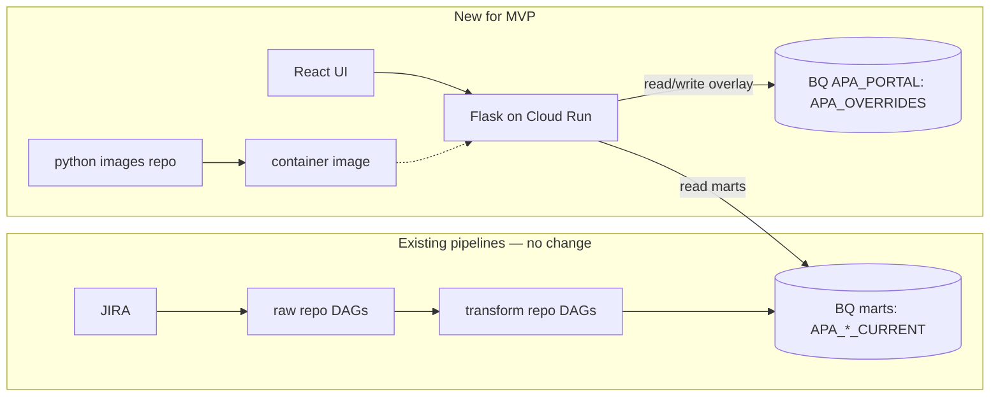

# Architecture Goals: APA JIRA Operations Portal (MVP)

> Transcription note: Recreated and cross-checked from photos `IMG_5568`, `IMG_5570`–`IMG_5584`.

## 1. Purpose

Define the MVP architecture for an internal portal where RPA PMs and stakeholders:

- **View** APA project and resource data originating from JIRA (already modeled in BigQuery with business-logic flags).
- **Track a project milestone timeline** — Assessment (auto-derived from JIRA) plus 7 manual milestones (ARP, Funding, Technical ARP, Data Eng, AA Dev, E2E Testing, Deployment).
- **Drill down** from a project into its linked Epic(s) and their Stories — a unified project→epic→story view with story points and status.
- **Edit** portal-only fields that do not exist in JIRA (milestone status/dates, portal status, target date, notes).
- **Define new columns on the fly** — users pick a column name and a data type (text, number, date, boolean, enum) and it becomes editable immediately, with **zero BigQuery schema change**.

The portal is a Cloud Run web app deployed on top of the **deal-inference-gateway-template** (the pattern for connecting custom apps to GCP/BigQuery): **Vite + React** frontend and **Flask (Python)** backend.

## 2. Current Platform Context (unchanged by this project)

- **Raw extract repos** ingest JIRA into raw BigQuery snapshot tables.
- **Transform repo** models raw snapshots into `*_CURRENT` marts (business logic lives here).
- **Python images repo** builds runtime images used by Cloud Run jobs/services.
- **Cloud Run + DAG config** are created/updated via **merge requests** in these repos.

The portal reuses this model. It does **not** change existing ETL or DAGs.

## 3. Data Model (read side)

The semantic (SEM) layer was simplified and standardized during the JIRA ingestion/transform MR review. Naming is now **locked**: every table uses a `T_` prefix, every column is `UPPER_SNAKE`, primary keys are `REQUIRED`, and tables are clustered on their lookup keys. The portal depends on `JIRA_SEMANTIC` read access and these key columns, not on any non-key column staying fixed.

Marts are **full-rebuild `WRITE_TRUNCATE` tables** (not views), partitioned on `TRANSFORM_LOADED_AT_UTC` (DAY), each representing the latest snapshot. Prod refresh is roughly daily (project transform first, resource transform after, early-morning Eastern). Portal data freshness is therefore ~daily.

### 3.1 Core marts (exist today — apajira transform repo)

| Mart (`JIRA_SEMANTIC`) | Grain | Key (REQUIRED) | Cluster | Notes |
|---|---|---|---|---|
| `T_APA_PROJECT_CURRENT` | one row per root issue | `ROOT_ISSUE_KEY` | `[ROOT_ISSUE_KEY]` | Hydrated fields (quoted price, PEATS #, reporter, account, budget code, CP4 name, manager…), money flags, derived development status, and a nested `LINKED_ISSUES` REPEATED RECORD (`LINKED_ISSUE_KEY`, `LINK_TYPE`, `IS_EPIC`, `STATUS`, `SUMMARY`). Carries `SOURCE_KEY`. |
| `T_APA_RESOURCE_ISSUE_CURRENT` | one row per sprint-issue | `SPRINT_ISSUE_KEY` (`sprint_id:issue_key`) | `[SPRINT_ID, ISSUE_KEY]` | Story points, progress, logged hours, `EPIC_KEY`, status/assignee, resource flags. Carries `SOURCE_KEY`. |

Raw layer (unchanged by the portal): `T_APA_PROJECT_SNAPSHOTS_RAW`, `T_APA_RESOURCE_SNAPSHOTS_RAW`, `T_FIELD_CATALOG` in `JIRA_INGESTION`; run/watermark state in the shared `SUPPORT.ETL_CONTROL_TABLE` (the old per-pipeline `INGESTION_CONTROL` and the `*_STATE_HASH` columns were dropped). `SOURCE_KEY` is carried on raw + marts so the same design can serve multiple JIRA queues/boards later; JIRA issue keys are already globally unique, so it is mainly for filtering/UX/partitioning and stays out of the natural keys until multi-board is real.

### 3.2 New marts (added by THIS project — same transform repo, 1nd-sem pattern)

Two additional marts give the portal a project→epic→story unified view and a milestone timeline, with **no JIRA write-back**.

| Mart (`JIRA_SEMANTIC`) | Grain | Key | Purpose |
|---|---|---|---|
| `T_APA_PROJECT_EPIC_STORY_CURRENT` | one row per project × epic × story | `ROOT_ISSUE_KEY` + `EPIC_KEY` + `STORY_KEY` | Flattened bridge: project → its linked Epic(s) → each Epic's Stories (`EPIC_NAME`, `STORY_POINTS`, `STATUS`, `SPRINT_NAME`, `ASSIGNEE`). Powers the “epic dropdown + stories” drilldown as a direct read (no client-side join). Clustered `[ROOT_ISSUE_KEY, EPIC_KEY]`. |
| `T_APA_PROJECT_MILESTONE_CURRENT` | one row per project × milestone | `ROOT_ISSUE_KEY` + `MILESTONE_NAME` | Milestone timeline. The **Assessment** row is auto-derived from the request status changelog (started / in-progress / done + `DURATION_DAYS`). The other 7 milestones are seeded `not_started`; their real values come from the portal overlay (§3.3, §6–7). Clustered `[ROOT_ISSUE_KEY]`. |

**Where they live (confirmed):** dataset `JIRA_SEMANTIC` in the **sem** project per environment:

- dev `prj-cxbi-dev-smb-nane1-sem-01`
- uat `prj-cxbi-uat-smb-nane1-sem-01`
- prod `prj-cxbi-prod-smb-nane1-sem-2`

### 3.3 Milestones (the project lifecycle the dashboard tracks)

Ordered milestones per project:

| # | Milestone | Source |
|---|---|---|
| 1 | Assessment | **automatic** (JIRA changelog) |
| 2 | ARP | manual |
| 3 | Funding | manual |
| 4 | Technical ARP (TARP) | manual |
| 5 | Data Eng | manual |
| 6 | AA (Automation Anywhere) Dev | manual |
| 7 | E2E Testing | manual |
| 8 | Deployment | manual |

Lifecycle:

- A new project request is created and picked up → **Assessment** flips to `in progress` and the project appears on the dashboard.
- Assessment completes → **Assessment** is marked `done` with the **time it took** (`DURATION_DAYS`).
- The remaining 7 milestones are entered manually by PMs in the portal.

Assessment is **derived from the JIRA changelog** (already fetched via `expand=changelog`), validated against dev JIRA:

- Real status flow: To Do → Assigned → Under Assessment → Assessment Done Pending Approval → Awaiting Governance / Approved / Resolved.
- `STARTED_AT` = issue creation; `IN_PROGRESS_AT` = first transition into a status containing **“Under Assessment”**; `DONE_AT` = **last** transition into a status containing **“Assessment Done”** (last, because some requests reopen through it more than once); `DURATION_DAYS = DONE_AT - IN_PROGRESS_AT`.
- Coverage caveat: project-epic linkage is **partial** (~1 in 15 sampled). The design abstracts over this and simply reports coverage; teams backfill epic links over time.

The auto Assessment row is produced by `T_APA_PROJECT_MILESTONE_CURRENT`. The 7 manual milestones are stored and edited in the **app-owned overlay** (`APA_PORTAL`, §6–7) and merged at read time — the pipeline never stores manual input; the app never writes the mart.

## 4. The Core Constraint

`*_CURRENT` marts are **rebuilt from snapshots by the transform DAGs**. Any user edit written into a mart would be **overwritten on the next run**.

**Rule:** the app must **never write to pipeline-owned tables**. All user edits live in a **separate, app-owned dataset** (`APA_PORTAL`) that the pipeline never touches.

## 5. Target MVP Architecture



- One Cloud Run service (Flask serves API + built React assets).
- Backend **merges** each mart (base layer) with the portal overlay (edit layer) by natural key.
- Reads and writes go **app to BigQuery only**. No DAG participates in editing.

## 6. Data Model Strategy — Base + Overlay (agnostic, single table)

Two logical layers presented to the UI as one row:

- **Base layer (read-only):** `JIRA_SEMANTIC` marts.
- **Overlay layer (writable):** **one** app-owned table `APA_OVERRIDES` in dataset `APA_PORTAL`.

**Why one table (lightweight + agnostic):**

- One physical table + inline latest-row logic, instead of a table per grain.
- **Append-only doubles as audit** — full history is inherent, so no separate audit table for MVP.
- **`namespace`** lets multiple people/teams attach their own fields without collisions (multi-tenant answer).
- **`field_name`** lets a new custom column appear with **zero schema change**.
- **`entity_type` + `entity_key`** attach a value to any grain: `project` (`ROOT_ISSUE_KEY`), `resource` (`SPRINT_ISSUE_KEY`), `epic` (`EPIC_KEY`), `story` (`STORY_KEY`), or `milestone` (`ROOT_ISSUE_KEY`). A milestone attribute uses the stable `field_name` convention in §6.2, for example `ARP.status` or `DATA_ENG.completed_at`.
- **`source_key`** keeps the overlay board/queue-agnostic, mirroring the pipeline.

### 6.1 Dynamic user-defined columns (name + type, zero schema change)

Users add their own manual columns from the UI. Two app-owned tables make this safe and type-aware:

- **`APA_FIELD_DEFINITIONS`** — 1 small registry describing each custom column: `field_name`, display `label`, `data_type` (`text | number | date | boolean | enum`), optional `enum_options`, which `entity_type` it applies to, `namespace`, `editable`, and audit columns. Creating a column = one append to this registry.
- **`APA_OVERRIDES`** — stores the actual per-entity values (EAV, always as STRING). The registry's `data_type` tells the UI which input widget to render and tells the API how to validate/cast on read.

So **dynamic column and type selection/creation** needs **no BigQuery migration**: define the column (registry insert) → it renders with the right input type → values land in `APA_OVERRIDES`. Milestone attributes are seeded, well-known definitions (`data_type=enum` for status, `data_type=date` for dates).

### 6.2 Manual milestone field contract (status + schedule boundaries)

Keep the physical overlay table agnostic. Store each manual milestone as three independently versioned EAV fields rather than serializing one JSON object:

| Milestone | Stable token | Status field | Start field | End field |
|---|---|---|---|---|
| ARP | `ARP` | `ARP.status` | `ARP.started_at` | `ARP.completed_at` |
| Funding | `FUNDING` | `FUNDING.status` | `FUNDING.started_at` | `FUNDING.completed_at` |
| Technical ARP | `TARP` | `TARP.status` | `TARP.started_at` | `TARP.completed_at` |
| Data Eng | `DATA_ENG` | `DATA_ENG.status` | `DATA_ENG.started_at` | `DATA_ENG.completed_at` |
| AA Dev | `AA_DEV` | `AA_DEV.status` | `AA_DEV.started_at` | `AA_DEV.completed_at` |
| E2E Testing | `E2E_TESTING` | `E2E_TESTING.status` | `E2E_TESTING.started_at` | `E2E_TESTING.completed_at` |
| Deployment | `DEPLOYMENT` | `DEPLOYMENT.status` | `DEPLOYMENT.started_at` | `DEPLOYMENT.completed_at` |

- `status` is an enum: `not_started | in_progress | done | blocked`.
- `started_at` and `completed_at` are ISO `YYYY-MM-DD` values in the overlay and are typed as `date` by `APA_FIELD_DEFINITIONS`. The UI labels them **Start date** and **End date** so planned manual windows can power the portfolio timeline; status tells the user whether that window is planned, active, blocked, or complete.
- Assessment is never written to the overlay. Its status/start/end values continue to come from `T_APA_PROJECT_MILESTONE_CURRENT` and are normalized into the same API read model.
- `PATCH /milestones/{name}` validates the whole payload first, then appends only the changed attributes as one batch. All rows from the request share actor and request timestamp; the request is guarded by one idempotency key, while `version` remains monotonic per full key tuple.
- An omitted attribute means “unchanged.” An explicit JSON `null` appends a null latest value and therefore clears a manual date without deleting audit history.
- Reject unknown tokens, writes to Assessment, invalid enum values, non-ISO dates, and any range where `started_at > completed_at`.
- The append history records schedule movement naturally: a future `completed_at` is the current planned end while a milestone is not done; the latest value becomes the confirmed end when status changes to `done`. If governance later needs plan-vs-actual reporting, add distinct planned fields rather than silently changing these semantics.

The registry seeds 24 definitions (three attributes × eight milestones). Assessment's three definitions have `editable=false`; the remaining 21 definitions have `editable=true`. Use `sort_order = milestone_ordinal * 10 + attribute_ordinal`, where status/start/end use ordinals 1/2/3. This preserves the governed milestone order while keeping every value typed and independently auditable.

### 6.3 Write pattern — append-only + “current” view (recommended)

BigQuery is analytical, not transactional. Row-by-row `UPDATE` DML has quotas/latency and is the wrong tool for interactive edits. This mirrors the **proven DPE portal pattern** (it writes feedback via append `WRITE_APPEND` load jobs, never row UPDATEs). Instead:

- Each edit is an **`INSERT`** of a new row (BQ client `insert_rows_json` streaming, or an append load job — both cheap, queryable in seconds).
- A **view** returns the latest row per key tuple (`ROW_NUMBER() OVER (PARTITION BY source_key, entity_type, entity_key, namespace, field_name ORDER BY updated_at_utc DESC, version DESC) = 1`).
- Audit history is captured **for free**; no UPDATE quota contention.

### 6.4 Alternative — MERGE (upsert) DML

For very low edit volume, a single-row-per-key table updated with `MERGE` is acceptable. Trade-off: DML quotas, higher latency, and you lose free history. **MVP default is 6.3.**

## 7. BigQuery Schema (`APA_PORTAL` dataset)

### 7.1 Single overlay table — `APA_OVERRIDES` (append-only, EAV)

```json
[
  {"name":"source_key","type":"STRING","mode":"REQUIRED","description":"Board/queue identifier (agnostic); single value today"},
  {"name":"entity_type","type":"STRING","mode":"REQUIRED","description":"project | resource | epic | story | milestone"},
  {"name":"entity_key","type":"STRING","mode":"REQUIRED","description":"root_issue_key | sprint_issue_key | epic_key | story_key"},
  {"name":"namespace","type":"STRING","mode":"REQUIRED","description":"Logical owner/group for portal-managed fields"},
  {"name":"field_name","type":"STRING","mode":"REQUIRED","description":"Stable field identifier, e.g. ARP.status, ARP.started_at, portal_status, notes"},
  {"name":"field_value","type":"STRING","mode":"NULLABLE","description":"Stringified user value (cast per APA_FIELD_DEFINITIONS.data_type on read)"},
  {"name":"updated_by","type":"STRING","mode":"REQUIRED","description":"Authenticated user email"},
  {"name":"updated_at_utc","type":"TIMESTAMP","mode":"REQUIRED","description":"Write timestamp (server-set); also the audit time"},
  {"name":"version","type":"INTEGER","mode":"REQUIRED","description":"Monotonic version per key tuple (optimistic concurrency)"}
]
```

Partition on `updated_at_utc` (DAY), `require_partition_filter=false`, matching the mart convention.

### 7.1b Column registry — `APA_FIELD_DEFINITIONS` (dynamic columns + types)

```json
[
  {"name":"namespace","type":"STRING","mode":"REQUIRED","description":"Logical owner/group"},
  {"name":"entity_type","type":"STRING","mode":"REQUIRED","description":"project | resource | epic | story | milestone"},
  {"name":"field_name","type":"STRING","mode":"REQUIRED","description":"Stable identifier used as APA_OVERRIDES.field_name"},
  {"name":"label","type":"STRING","mode":"REQUIRED","description":"Human display label"},
  {"name":"data_type","type":"STRING","mode":"REQUIRED","description":"text | number | date | boolean | enum"},
  {"name":"enum_options","type":"STRING","mode":"REPEATED","description":"Allowed values when data_type = enum"},
  {"name":"editable","type":"BOOL","mode":"REQUIRED","description":"False for read-only/derived (e.g. auto Assessment)"},
  {"name":"sort_order","type":"INTEGER","mode":"NULLABLE","description":"UI ordering (milestone attributes use milestone ordinal * 10 + attribute ordinal)"},
  {"name":"active","type":"BOOL","mode":"REQUIRED","description":"Soft delete/hide without dropping history"},
  {"name":"created_by","type":"STRING","mode":"REQUIRED","description":"Who defined the column"},
  {"name":"created_at_utc","type":"TIMESTAMP","mode":"REQUIRED","description":"When it was defined"}
]
```

The milestone editor ships with 24 seeded attribute definitions (`entity_type='milestone'`; status/start/end for all eight milestones). Assessment definitions are `editable=false`; the other 21 are editable. Everything else the users create at runtime.

### 7.2 Reading the latest value — computed inline (no persisted view)

Views are **not** confirmed to be natively supported by the shared BQ module. Rather than add a post-deploy SQL step, the app computes “latest row per key” **inline** in its read query (the app already queries BigQuery, so this adds no infra). The full merged read is:

### 7.3 Merged read (the single query the API runs)

Pick the latest override row per key tuple, pivot fields to columns, then LEFT JOIN onto the mart:

```sql
-- Project example
WITH Latest AS (
  SELECT entity_key, field_name, field_value FROM (
    SELECT *, ROW_NUMBER() OVER (
      PARTITION BY source_key, entity_type, entity_key, namespace, field_name
      ORDER BY updated_at_utc DESC, version DESC) AS rn
    FROM `${sem_project}.APA_PORTAL.APA_OVERRIDES`
    WHERE entity_type = 'project' AND namespace = @namespace
  ) WHERE rn = 1
), ov AS (
  SELECT entity_key,
    MAX(IF(field_name='portal_status', field_value, NULL)) AS portal_status,
    MAX(IF(field_name='target_date', field_value, NULL)) AS target_date,
    MAX(IF(field_name='notes', field_value, NULL)) AS notes
  FROM Latest GROUP BY entity_key
)
SELECT c.*, ov.portal_status, SAFE_CAST(ov.target_date AS DATE) AS target_date, ov.notes
FROM `${sem_project}.JIRA_SEMANTIC.T_APA_PROJECT_CURRENT` c
LEFT JOIN ov ON ov.entity_key = c.root_issue_key;
```

Resource merge is identical with `entity_type='resource'` and `ov.entity_key = c.sprint_issue_key`. No persisted view object is required for MVP.

### 7.4 Project → epic → story unified view (new mart `T_APA_PROJECT_EPIC_STORY_CURRENT`)

The bridge mart already flattens project → epic → story, so the drilldown is a direct read (no join to raw). Optionally LEFT JOIN the overlay at `epic` / `story` grain for manual fields:

```sql
SELECT es.*, ov_story.notes AS story_notes
FROM `${sem_project}.JIRA_SEMANTIC.T_APA_PROJECT_EPIC_STORY_CURRENT` es
LEFT JOIN (
  SELECT entity_key, MAX(IF(field_name='notes', field_value, NULL)) AS notes
  FROM `${sem_project}.APA_PORTAL.APA_OVERRIDES`
  WHERE entity_type='story' AND namespace=@namespace
  GROUP BY entity_key
) ov_story ON ov_story.entity_key = es.story_key
WHERE es.root_issue_key = @root_issue_key
ORDER BY es.epic_key, es.story_key;
```

An epic-level rollup (points, done/blocked counts) is a simple `GROUP BY EPIC_KEY, EPIC_NAME` over the same mart. Add `source_key` to the GROUP BY once multi-board is live.

### 7.5 Milestone timeline read

Merge the auto Assessment row from the mart with the 7 manual milestones from the overlay:

```sql
WITH LatestManual AS (
  SELECT entity_key, field_name, field_value
  FROM (
    SELECT *, ROW_NUMBER() OVER (
      PARTITION BY source_key, entity_type, entity_key, namespace, field_name
      ORDER BY updated_at_utc DESC, version DESC) AS rn
    FROM `${sem_project}.APA_PORTAL.APA_OVERRIDES`
    WHERE source_key = @source_key
      AND entity_type = 'milestone'
      AND namespace = @namespace
      AND REGEXP_CONTAINS(
        field_name,
        r'^(ARP|FUNDING|TARP|DATA_ENG|AA_DEV|E2E_TESTING|DEPLOYMENT)\.(status|started_at|completed_at)$'
      )
  )
  WHERE rn = 1
), Manual AS (
  SELECT
    entity_key AS root_issue_key,
    CASE SPLIT(field_name, '.')[SAFE_OFFSET(0)]
      WHEN 'ARP' THEN 'ARP'
      WHEN 'FUNDING' THEN 'Funding'
      WHEN 'TARP' THEN 'Technical ARP'
      WHEN 'DATA_ENG' THEN 'Data Eng'
      WHEN 'AA_DEV' THEN 'AA Dev'
      WHEN 'E2E_TESTING' THEN 'E2E Testing'
      WHEN 'DEPLOYMENT' THEN 'Deployment'
    END AS milestone_name,
    MAX(IF(SPLIT(field_name, '.')[SAFE_OFFSET(1)] = 'status', field_value, NULL)) AS status,
    MAX(IF(SPLIT(field_name, '.')[SAFE_OFFSET(1)] = 'started_at', field_value, NULL)) AS started_at,
    MAX(IF(SPLIT(field_name, '.')[SAFE_OFFSET(1)] = 'completed_at', field_value, NULL)) AS completed_at
  FROM LatestManual
  GROUP BY root_issue_key, milestone_name
)
SELECT
  m.root_issue_key,
  m.milestone_name,
  CASE
    WHEN UPPER(m.milestone_name) = 'ASSESSMENT' THEN m.status
    ELSE COALESCE(o.status, m.status, 'not_started')
  END AS status,
  CASE
    WHEN UPPER(m.milestone_name) = 'ASSESSMENT' THEN SAFE_CAST(m.started_at AS DATE)
    ELSE SAFE_CAST(o.started_at AS DATE)
  END AS started_at,
  CASE
    WHEN UPPER(m.milestone_name) = 'ASSESSMENT' THEN SAFE_CAST(m.completed_at AS DATE)
    ELSE SAFE_CAST(o.completed_at AS DATE)
  END AS completed_at,
  CASE
    WHEN UPPER(m.milestone_name) = 'ASSESSMENT' THEN m.duration_days
    ELSE DATE_DIFF(SAFE_CAST(o.completed_at AS DATE), SAFE_CAST(o.started_at AS DATE), DAY)
  END AS duration_days,
  CASE WHEN UPPER(m.milestone_name) = 'ASSESSMENT' THEN 'jira' ELSE 'manual' END AS source
FROM `${sem_project}.JIRA_SEMANTIC.T_APA_PROJECT_MILESTONE_CURRENT` m
LEFT JOIN Manual o
  ON o.root_issue_key = m.root_issue_key
 AND UPPER(o.milestone_name) = UPPER(m.milestone_name);
```

The mart supplies the complete eight-row milestone skeleton for every project, including seven seeded `not_started` rows. The LEFT JOIN therefore preserves milestones that have never been edited; the overlay only replaces their manual attributes.

## 8. Where/How the objects are created and filled

Confirmed with the repos: BigQuery objects are **convention-driven** via JSON + tfvars consumed by an external pipeline module (no SQL migrations folder). Mirror the `JIRA_SEMANTIC` pattern:

- **Schema JSON:** `apajira/sem/bq/APA_PORTAL/_dataset.json`, `.../APA_OVERRIDES.json`, `.../APA_FIELD_DEFINITIONS.json`.
- **Terraform metadata:** `apajira/devops/tf/sem/bq_tf/APA_PORTAL/_dataset.json` and `.../tables/{APA_OVERRIDES,APA_FIELD_DEFINITIONS}.json` (partition on `updated_at_utc` / `created_at_utc`).
- **New read marts** (`T_APA_PROJECT_EPIC_STORY_CURRENT`, `T_APA_PROJECT_MILESTONE_CURRENT`) are created in the **apajira transform repo** (JSON + `bq_tf` + a transform view module + DAG), not in the portal MR — the portal only consumes them.
- **Views:** not natively supported (confirmed — only dataset/table JSON found). MVP avoids persisted views by computing latest **inline in the app** (§7.3). If a view is later wanted, add it as a **post-deploy SQL step**.
- **Cloud Run service config** (SA binding, env vars) lives in the app's own **use-case / devops-central repo** (pattern: `devops/tf/inge` + `inge/gcr` + a `.gitlab-ci` include), **not** in the transform repo. Deploying the portal means an MR there, separate from the `APA_PORTAL` object MR.
- **Filled by the app, not the pipeline.** Transform DAGs never write to `APA_PORTAL`. The Flask backend appends override rows via the BigQuery client under the portal service account. The pipeline only **creates** the objects; runtime **inserts** come from the app.

## 9. API Design (MVP)

Versioned from day one under `/api/v1`.

| Method | Path | Purpose |
|---|---|---|
| GET | `/api/v1/projects` | Merged project rows (base + overlay), with filters + pagination |
| PATCH | `/api/v1/projects/{root_issue_key}/overrides` | Update project override fields |
| GET | `/api/v1/projects/{root_issue_key}/milestones` | Milestone timeline (auto Assessment + 7 manual) |
| PATCH | `/api/v1/projects/{root_issue_key}/milestones/{milestone_name}` | Update a manual milestone (status/dates) |
| GET | `/api/v1/projects/{root_issue_key}/epics` | Unified project → epic → story drilldown (base + overlay) |
| GET | `/api/v1/resources` | Merged sprint-issue rows (base + overlay) |
| PATCH | `/api/v1/resources/{sprint_issue_key}/overrides` | Update resource override fields |
| GET | `/api/v1/field-definitions` | List custom column definitions (for a namespace/entity_type) |
| POST | `/api/v1/field-definitions` | Create a new dynamic column (name + data_type + options) |
| GET | `/api/v1/health` | Health check |

- Server-side allow-list of editable fields **derived from `APA_FIELD_DEFINITIONS`** (`editable=true`); reject anything else.
- New columns are validated on create (name uniqueness per namespace/entity_type, valid `data_type`, enum options required when `data_type=enum`).
- Values are validated/cast to the registry `data_type` on write and on read.
- Optimistic concurrency: client sends `version`; server rejects on mismatch.
- Every successful PATCH appends an override row (history is inherent).
- Enforce query bounds (date filters, row limits) for BigQuery cost/latency.

## 10. Authentication (MVP options)

Needed so `updated_by` / audit are trustworthy.

| Option | How | Pros | Cons | Recommendation |
|---|---|---|---|---|
| **A. IAP in front of Cloud Run** | Verified identity via `X-Goog-Authenticated-User-Email` header | No password mgmt; trustworthy audit; enterprise-standard | Requires IAP enablement on the service | **Preferred if available** |
| **B. Enterprise SSO / gateway auth** | Reuse existing Inference Gateway auth pattern | Consistent with platform | Depends on what the gateway already provides | Use if IAP not available |
| **C. Email-entry gate** | User enters Bell email (like DPE portal) | Fastest to ship | Weak audit (self-asserted identity) | Stopgap only, with a replacement date |

**MVP choice:** mirror the **DPE portal precedent** — Bell email entry + shared password gate (env var), `@bell.ca` check — for consistency and speed. Treat IAP/SSO as a later hardening upgrade.

## 11. Infrastructure & MR Plan

1. Fork `deal-inference-gateway-template` into the new portal repo.
2. Keep MVP as a **single Cloud Run service** (Flask serves built React assets).
3. Extend the image build to compile the Vite frontend, then run Flask (multi-stage or a build step in the python images pipeline).
4. Create the `APA_PORTAL` dataset + `APA_OVERRIDES` table via the JSON + `bq_tf` convention (MR in the transform repo).
5. Configure the Cloud Run service (SA binding, env vars) via an MR in the **use-case / devops-central repo** (`devops/tf/inge` + `inge/gcr` + `.gitlab-ci` include) — separate from step 4.
6. No DAG changes required for editing (writes are app to BQ). No persisted views required (latest computed inline).

### Runtime service account `apatracker` — Least privilege

**New use case + new SA** (confirmed). Name `apatracker` (confirmed unique in `terraform.tfvars`; lowercase, no separators). Granted in the `sa_roles`/tfvars style used by the pipeline SA (lnd: jobUser + dataViewer, sem: jobUser + dataEditor). For the portal SA:

- `roles/bigquery.jobUser` on the query-execution project (the **sem** project, where reads/writes run)
- `roles/bigquery.dataViewer` on `JIRA_SEMANTIC` (read marts)
- `roles/bigquery.dataEditor` scoped to `APA_PORTAL` (write overlay)

**IAM scope decision (confirmed constraint):** only **project-scoped** `sa_roles` are evident in the repos. A project-scoped `dataEditor` on the sem project would also permit writing to `JIRA_SEMANTIC` (the marts). Options, in order of cleanliness:

1. **Dataset-scoped `dataEditor` on `APA_PORTAL`** — if the module supports it (confirm with platform). Cleanest.
2. **`APA_PORTAL` in a separate project** — a project-scoped editor there cannot touch the marts. Clean, but new project setup.
3. **Project-scoped editor on sem + app discipline** — matches the **DPE portal precedent** (DPE reads and writes in one project and simply never writes to its read tables). Fastest, relies on code review; flag for hardening.

The runtime SA identity is minted by the external devops-central module, so the exact principal per env is confirmed by the platform team when the use case is created — you only choose the use-case name (`apatracker`).

### Environment variables (Cloud Run)

- `PROJECT_ID` (Cloud Run/inge project), `BQ_EXEC_PROJECT_ID` (sem project — where jobs run)
- `BQ_MARTS_DATASET` = `JIRA_SEMANTIC` (reads `T_APA_PROJECT_CURRENT`, `T_APA_RESOURCE_ISSUE_CURRENT`, `T_APA_PROJECT_EPIC_STORY_CURRENT`, `T_APA_PROJECT_MILESTONE_CURRENT`)
- `BQ_PORTAL_DATASET` = `APA_PORTAL`
- `SOURCE_KEY` (agnostic board/queue value), `OVERRIDE_NAMESPACE` default
- `OVERRIDES_TABLE` = `APA_OVERRIDES`, `FIELD_DEFINITIONS_TABLE` = `APA_FIELD_DEFINITIONS`

## 12. Security & Governance

- Editable fields restricted to a server-side allow-list.
- Base JIRA-derived fields are immutable in the portal.
- Full audit trail for every change.
- Secrets/config via environment / secret manager only — never in code.
- App has **no external egress** (BigQuery only) — no firewall request needed.

## 13. Operational Goals

- `/api/v1/health` endpoint + structured JSON logs with request ids.
- Query cost/latency guardrails (mandatory filters, row limits).
- Named owners for the schema contract (marts) and portal dataset.

## 14. MVP Exit Criteria

- Users view merged base + overlay data for projects and sprint-issues in one UI.
- Users edit allow-listed override fields at both grains.
- Edits are appended to `APA_OVERRIDES`; the inline latest-row logic reflects the newest value; prior rows remain as audit history.
- Object creation (transform repo MR) and Cloud Run config (use-case repo MR) flow through existing MR governance.
- No JIRA write-back; no writes to pipeline-owned marts.

## 15. Open Decisions

1. **IAM scope** — confirm dataset-scoped `dataEditor` on `APA_PORTAL`; if unsupported, choose separate project vs project-scoped + app discipline (DPE-aligned). See section 11.
2. **Overlay storage shape** — EAV `APA_OVERRIDES` + `APA_FIELD_DEFINITIONS` registry (flexible, zero schema churn) vs a wide one-column-per-field table (simpler if the field set is small and fixed). Default EAV; revisit if fields stay few.
3. **Editable fields per grain** — seeded milestone set + governance sign-off for who may create new dynamic columns (all users vs admins only).
4. **Milestone storage** — auto Assessment from `T_APA_PROJECT_MILESTONE_CURRENT`; manual 7 in the overlay merged at read (recommended) vs pipeline reading portal data to fully materialize the mart (rejected: couples pipeline to app data).
5. **Assessment “done” definition** — `Assessment Done Pending Approval` (validated) vs waiting for `Approved` / `Resolved`.
6. **`source_key` rollout** — nullable on raw now, propagate to marts; keep out of natural keys until multi-board is real.

## 16. Local Development & Testing

The app reads/writes **BigQuery only** (no JIRA calls at runtime), so local dev needs no proxy/SSL handling — just BigQuery auth against the **dev** projects.

- **Auth:** `gcloud auth application-default login` with a user that already has `JIRA_SEMANTIC` read + `APA_PORTAL` write in dev (the same grants the `apatracker` SA will get). The BigQuery client picks up ADC automatically.
- **Isolation:** use a dedicated `OVERRIDE_NAMESPACE` (e.g. `dev-<you>`) so local edits never collide with real overlay rows in the shared dev `APA_PORTAL`. Because the overlay is append-only + namespaced, this is safe and disposable.
- **Backend:** run Flask locally with dev env vars:

```powershell
$env:BQ_EXEC_PROJECT_ID="prj-cxbi-dev-smb-nane1-sem-01"
$env:BQ_MARTS_DATASET="JIRA_SEMANTIC"; $env:BQ_PORTAL_DATASET="APA_PORTAL"
$env:OVERRIDE_NAMESPACE="dev-simon"; $env:SOURCE_KEY="APA"
flask --app app run --debug --port 8080
```

- **Frontend:** `npm run dev` (Vite) with a dev-server proxy forwarding `/api` → `http://localhost:8080`, so the React app talks to local Flask exactly as it will in the single Cloud Run service.
- **Auth gate locally:** stub the identity header/email gate (e.g. `LOCAL_USER_EMAIL`) so `updated_by` is populated without standing up IAP/SSO; keep the real gate behind an env flag.
- **Seed data:** insert the 24 milestone attribute definitions from §6.2 into `APA_FIELD_DEFINITIONS` (Assessment attributes `editable=false`) so the milestone UI renders on first run. A tiny `scripts/seed_field_definitions.py` (BQ `insert_rows_json`) mirrors the existing local-scaffold script style.
- **Contract test:** before wiring UI, run the merged-read SQL (§7.3–7.5) directly against dev to confirm the marts + overlay join returns rows — the same approach used by `test_dashboard_fetch.py` to validate JIRA fetch before touching pipelines.

## 17. APA Tracker frontend reference implementation

The repository now contains the production-shaped React MVP under `frontend/`. It is intentionally frontend-first: all workflows are interactive with deterministic demo data, while mutations persist to a versioned browser overlay until the Flask service is connected.

### 17.1 Delivered product surfaces

- **Project command center:** one compact operating surface with a horizontally scrollable register and a schedule view; project identity remains pinned while users review the full record.
- **Resource command center:** an assignee+sprint workload roster (retained from the useful part of the Streamlit prototype) drives a source-backed sprint-issue table from `T_APA_RESOURCE_ISSUE_CURRENT`. Registered resource-grain workspace columns edit beside the locked JIRA fields.
- **Source-backed project columns:** root issue key, PEATS number, account, manager, quoted price, budget code, CP4 name, reporter, source key, and derived development status come from `T_APA_PROJECT_CURRENT`.
- **Eight milestone columns and timeline:** Assessment, ARP, Funding, Technical ARP, Data Eng, AA Dev, E2E Testing, and Deployment appear together in every project row. The timeline uses their start/end boundaries; status color is used only to encode `done`, `in_progress`, `blocked`, or `not_started`.
- **Project workspace:** source fields, linked issues, the eight-milestone editor, delivery-resource context above project→epic→story work, and portal-owned fields are separated into focused tabs.
- **Dynamic field workflow:** creates one of the five registered field types at project or resource grain and immediately exposes it as an editable column without changing a BigQuery schema.
- **Operational controls:** source-field search, manager/account filters, column sorting/filtering/resizing, pagination, a custom-field visibility control, and keyboard quick find.
- **Responsive shell:** navigation collapses at compact widths while the register retains intentional internal horizontal scrolling instead of collapsing source fields into decorative cards.

The demo stores `projects` and `field definitions` in versioned `apa-tracker.*` local-storage envelopes. This is only a local adapter. It is not intended to emulate audit identity, optimistic concurrency, or BigQuery latency.

### 17.2 Frontend integration boundary

`frontend/src/services/projectRepository.ts` defines the backend-facing `ProjectRepository` contract and canonical API paths. The MVP currently keeps mutation handlers in `App.tsx` so it runs with zero infrastructure. When connecting Flask, implement an HTTP repository and move those handlers behind it; component props and the shared `Project` model do not need to change.

| UI operation | API call | Overlay entity / registry effect |
|---|---|---|
| Load portfolio | `GET /api/v1/projects` | Merged project base + latest project overrides |
| Edit typed cell | `PATCH /api/v1/projects/{key}/overrides` | Append one `project` override row |
| Change portal status / target date / notes | `PATCH /api/v1/projects/{key}/overrides` | Append one row per changed allow-listed field |
| Update a manual milestone | `PATCH /api/v1/projects/{key}/milestones/{name}` | Append changed `{TOKEN}.status`, `{TOKEN}.started_at`, and `{TOKEN}.completed_at` rows; reject Assessment |
| Open project work tab | `GET /api/v1/projects/{key}/epics` | Read flattened epic/story mart, optionally merged with overlays |
| Load resource workspace | `GET /api/v1/resources` | Read sprint-issue mart + latest resource overrides; aggregate assignee workload in the client |
| Edit resource workspace cell | `PATCH /api/v1/resources/{sprint_issue_key}/overrides` | Append one registered `resource` override row |
| Load column manager | `GET /api/v1/field-definitions?entity_type=project` | Read active typed registry entries |
| Load resource columns | `GET /api/v1/field-definitions?entity_type=resource` | Read active resource-grain definitions |
| Create workspace field | `POST /api/v1/field-definitions` | Append/register a new active definition |

The guide intentionally defines no JIRA issue-creation endpoint, so the reference frontend does not manufacture local projects. A future create action must route to an approved intake service and must not insert a fake base-mart row. Assessment remains JIRA-derived and immutable from the portal.

### 17.3 Recommended API envelopes

Use a stable envelope so pagination, freshness, and request tracing do not become breaking changes:

```json
{
  "items": [],
  "page": 1,
  "page_size": 50,
  "total": 0,
  "as_of_utc": "2026-07-16T10:42:00Z",
  "request_id": "01J..."
}
```

Override writes should send the version last read by the client:

```json
{
  "version": 4,
  "fields": {
    "portal_status": "Governance review",
    "target_date": "2026-09-12",
    "notes": "Funding decision scheduled for the governance meeting."
  }
}
```

Milestone writes carry field-level versions because status, start, and end are independent append-only tuples:

```json
{
  "versions": {"status": 4, "started_at": 2, "completed_at": 2},
  "fields": {
    "status": "in_progress",
    "started_at": "2026-07-06",
    "completed_at": "2026-07-24"
  }
}
```

The API maps the route milestone name to the stable token in §6.2; clients never construct arbitrary `field_name` values. It checks the version of every changed tuple before appending the batch and returns the canonical milestone plus its three new versions.

Return the canonical merged project and new version after a successful append. Use one error shape everywhere:

```json
{
  "error": {
    "code": "VERSION_CONFLICT",
    "message": "This project changed after you opened it.",
    "current_version": 5,
    "request_id": "01J..."
  }
}
```

Recommended status codes: `400` invalid payload, `401` unauthenticated, `403` field/action not allowed, `404` unknown natural key, `409` stale version or duplicate field identifier, `422` registered-type validation failure, and `503` bounded upstream/BigQuery unavailability.

## 18. Flask implementation blueprint

Keep transport, domain validation, and BigQuery access separate. A practical package layout is:

```text
backend/
  app/
    __init__.py              # Flask factory, config, error mapping
    auth.py                  # verified IAP/SSO identity only
    api/
      health.py
      projects.py
      milestones.py
      field_definitions.py
    services/
      project_service.py     # merge/use-case orchestration
      validation.py          # registry-driven casting + allow-list
    repositories/
      marts.py               # parameterized read-only queries
      overrides.py           # append rows + current-version reads
      field_definitions.py
    observability.py         # request ids, structured JSON logs
  tests/
    contract/
    unit/
```

### 18.1 Connection order

1. Add the Flask factory, configuration validation, `/api/v1/health`, request ids, and verified local identity stub.
2. Implement parameterized merged project reads with a strict page-size cap and freshness metadata.
3. Implement field-definition reads and registry-driven serialization.
4. Implement append-only overrides with server timestamps, authenticated `updated_by`, and version-conflict checks.
5. Implement manual milestone writes; keep Assessment immutable and sourced from the mart.
6. Implement epic/story reads and bounded project-key filters.
7. Add the frontend HTTP repository, loading/error states, optimistic updates, and rollback on failure.
8. Build React in the container build stage and serve `frontend/dist` from Flask on the same origin. Disable production CORS because no cross-origin client is required.
9. Run contract tests against dev BigQuery using an isolated namespace before requesting Cloud Run/IAM changes.

### 18.2 Production gates

- **Identity:** IAP or approved enterprise SSO is the production default. A self-entered email must never be trusted for `updated_by`; the shared-password pattern is acceptable only as an explicitly time-bounded internal pilot exception.
- **Authorization:** distinguish field-definition administration from ordinary value editing. Enforce it server-side, never through hidden UI alone.
- **Concurrency:** compare the client version with the latest key-tuple version inside the write workflow. Return `409` with the canonical current value on mismatch.
- **Idempotency:** accept an `Idempotency-Key` on POST/PATCH and retain a short-lived result record so browser retries cannot append duplicate audit rows.
- **Validation:** normalize field identifiers once, reject reserved names, cap label/value/option lengths, and require at least two unique enum options.
- **Query safety:** parameterize every natural key and filter; allow-list project/dataset/table identifiers from server configuration; enforce maximum rows and execution timeout.
- **Observability:** log request id, route, status, authenticated actor, entity type/key, field names (not sensitive values), BigQuery job id, bytes processed, and latency.
- **Failure UX:** preserve unsaved form input, identify the field that failed, and provide retry for transient failures. Never show a successful toast until the server returns the appended version.
- **Accessibility:** preserve visible focus, dialog focus management, grid keyboard navigation, and reduced-motion behavior when replacing demo handlers.

### 18.3 Derived intelligence policy

The first connected release should remain source-backed: do not add health, priority, attention, or risk scores until their input fields and ownership are registered in the data contract and their formula is governance-approved. If a derived ranking is added later, compute it server-side, return its contributing facts, and let the UI explain the result. An LLM may summarize those facts, but it must not silently decide portfolio priority.
